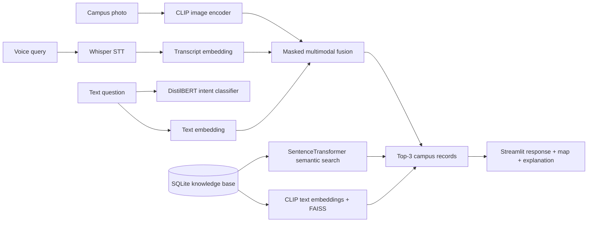

# Smart Campus Tour & Information Multi-Modal Chatbot

MSc Artificial Intelligence project implementing a multimodal campus assistant with image understanding, voice understanding, text understanding, knowledge retrieval, multimodal fusion, evaluation, Streamlit deployment, and Docker containerization.

## Architecture



## Features

- 20 realistic synthetic campus locations with descriptions, categories, opening hours, coordinates, and events.
- SQLite knowledge base plus JSON export.
- Synthetic FAQ dataset with at least 300 examples across 10 intents.
- CLIP + FAISS image retrieval using `openai/clip-vit-base-patch32`.
- Whisper speech-to-text for `wav`, `mp3`, and `m4a` inputs.
- DistilBERT intent classifier using `distilbert-base-uncased`.
- SentenceTransformer semantic search over campus descriptions.
- MLP multimodal fusion with zero-vector padding and modality masks.
- Streamlit interface with uploads, chat history, confidence visualization, explanations, and interactive map.
- Evaluation scripts for vision, speech, intent, fusion, testing scenarios, and publication-style figures.
- Docker and Docker Compose deployment.

## Project Structure

```text
project/
├── app.py
├── requirements.txt
├── Dockerfile
├── docker-compose.yml
├── README.md
├── data/
│   ├── campus_images/
│   ├── audio_queries/
│   ├── faq_dataset.csv
│   ├── campus_locations.json
│   └── knowledge_base.db
├── models/
│   ├── vision/
│   ├── nlp/
│   ├── fusion/
│   └── checkpoints/
├── notebooks/
├── src/
│   ├── image_pipeline.py
│   ├── audio_pipeline.py
│   ├── text_pipeline.py
│   ├── knowledge_base.py
│   ├── fusion_model.py
│   ├── train_intent.py
│   ├── evaluate.py
│   └── utils.py
├── reports/
│   ├── figures/
│   ├── results/
│   └── dissertation_support.md
└── tests/
```

Derived files such as `data/faq_dataset.csv`, `data/knowledge_base.db`, generated images, metrics, and charts are created automatically by the app or by running the generation command below.

## Installation

```bash
cd project
python3.11 -m venv .venv
source .venv/bin/activate
pip install --upgrade pip
pip install -r requirements.txt
python -m src.utils --generate
```

Whisper requires `ffmpeg`. On macOS:

```bash
brew install ffmpeg
```

## Run Streamlit

```bash
streamlit run app.py
```

Open `http://localhost:8501`.

## Train DistilBERT Intent Classifier

```bash
python -m src.train_intent --epochs 3 --batch-size 16
```

The fine-tuned model is saved to:

```text
models/nlp/distilbert-intent/
```

Training curves are saved to:

```text
reports/figures/training_loss_curves.png
reports/figures/validation_accuracy_curve.png
```

## Run Evaluation

Fast evaluation without heavy CLIP download:

```bash
python -m src.evaluate --skip-heavy
```

Full evaluation:

```bash
python -m src.evaluate
```

Outputs include:

- `reports/results/intent_metrics.csv`
- `reports/results/vision_metrics.csv`
- `reports/results/fusion_metrics.csv`
- `reports/results/testing_results.csv`
- `reports/results/model_comparison.csv`
- `reports/results/error_analysis.csv`
- `reports/figures/intent_confusion_matrix.png`
- `reports/figures/vision_confusion_matrix.png`
- `reports/figures/fusion_accuracy.png`
- `reports/figures/model_comparison.png`
- `reports/figures/embedding_similarity_plot.png`
- `reports/figures/faq_word_cloud.png`

## Docker Deployment

Build:

```bash
docker build -t smart-campus-chatbot .
```

Run:

```bash
docker run -p 8501:8501 smart-campus-chatbot
```

Or use Compose:

```bash
docker compose up --build
```

## Dataset Design

The synthetic campus dataset contains 20 locations, including Library, Student Union, Cafeteria, Computer Lab, Lecture Hall A, Lecture Hall B, Sports Centre, Administration Office, Innovation Hub, Career Centre, and other student-facing buildings. Each record contains a name, category, description, opening hours, coordinates, and event list.

The FAQ dataset is generated with controlled templates and augmentation to support 10 intents:

- `find_location`
- `opening_hours`
- `event_query`
- `facility_information`
- `study_space`
- `food_services`
- `accessibility`
- `greeting`
- `goodbye`
- `other`

## Screenshots

Add screenshots after running locally:

- `reports/figures/streamlit_home.png`
- `reports/figures/multimodal_result.png`
- `reports/figures/evaluation_dashboard.png`

## Future Improvements

- Replace synthetic building images with real campus photography and consent-cleared metadata.
- Add GPS-aware route planning and indoor navigation.
- Train the fusion model on collected multimodal interaction logs.
- Add multilingual Whisper and FAQ support.
- Add role-aware answers for students, staff, and visitors.
- Add human feedback loops for retrieval correction.

## References

- Radford, A. et al. (2021) "Learning transferable visual models from natural language supervision." ICML.
- Radford, A. et al. (2022) "Robust speech recognition via large-scale weak supervision."
- Sanh, V. et al. (2019) "DistilBERT, a distilled version of BERT."
- Johnson, J., Douze, M. and Jegou, H. (2019) "Billion-scale similarity search with GPUs." IEEE Transactions on Big Data.
- Reimers, N. and Gurevych, I. (2019) "Sentence-BERT: Sentence embeddings using Siamese BERT-networks." EMNLP-IJCNLP.
